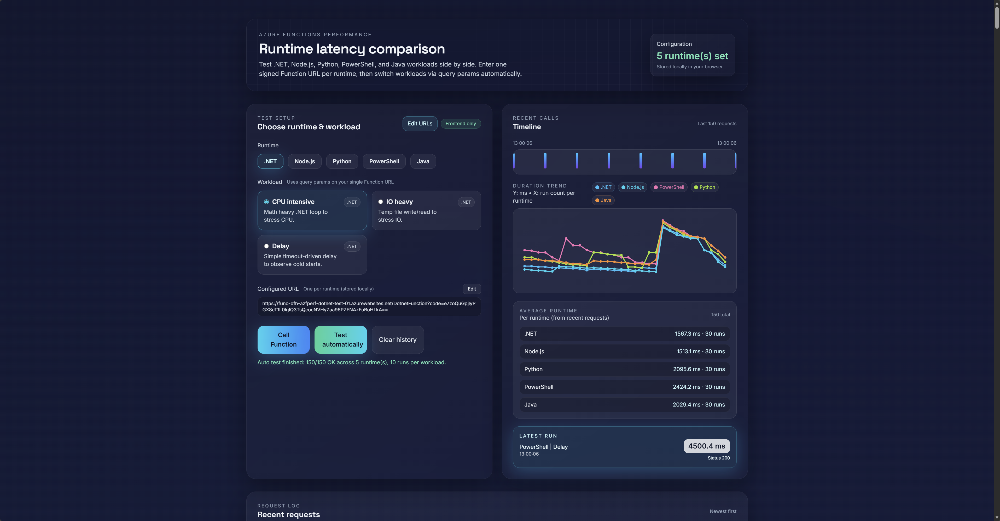

# Azure Function Performance Bench

This repository provides a complete, deployable benchmark suite for Azure Functions. It includes:
- Deployment templates that create one Function App per runtime (Flex Consumption) plus required storage and Application Insights using eighter Bicep or ARM templates.
- Example functions in .NET, Node.js, Python, PowerShell, and Java that expose identical workload parameters (CPU, IO, delay benchmarks).
- A static SvelteKit webapp that calls those functions, runs automated batches, and visualizes latency trends.

## 📁 Repository Structure
```
├── deployment/                       # ARM/Bicep templates and deploy docs
├── functions/                        # Azure Functions per runtime (dotnet, node, python, powershell, java)
├── webapp/                           # SvelteKit frontend-only UI
├── .github/workflows/                # Release packaging workflows
├── .gitlab-ci.yml                    # CI pipeline (if used)
└── README.md                         # This file
```

## 🚀 Quick Start

### Prerequisites
1. Azure subscription with permissions to create resource groups and Function Apps
2. Azure CLI (for deployments and zip deploy)
3. Optional: Azure Functions Core Tools (local runs)
4. Webapp build: Node.js 20+ and npm/pnpm
5. Java function build: JDK 17 and Maven
6. .NET function build: .NET SDK 8

### High-Level Flow
1. Deploy the sample functions for the runtimes you want to measure
2. Open the webapp and paste one signed Function URL per runtime
3. Run manual calls or automated batches; the UI records durations and renders timelines and trends

### Live Example
There is a public hosted version of this projects webapp. It has the example functions from `./functions/` directory. To visit an example of the webapp use this button:

<a href="https://azfunctionsperformance.apps.lucanoahcaprez.ch/" style="display:inline-block;padding:8px 14px;border-radius:10px;border:1px solid currentColor;color:inherit;font-weight:600;text-decoration:none;background:rgba(255,255,255,0.06);">Visit Azure Functions Performance Webapp</a>
<br>
<br>
After running the automatic mode it will look sort of like that:



## 🔄 Deployment Methods

### Method 1: Deploy Functions via ARM/Bicep
Use the deploy button to create one Function App per runtime. The template optionally accepts zip package URIs.

[](https://portal.azure.com/#create/Microsoft.Template/uri/https%3A%2F%2Fraw.githubusercontent.com%2Flucanoahcaprez%2FAzure-Functions-Performance%2Fmain%2Fdeployment%2Fazuredeploy.json)

Details: `deployment/README.md`

### Method 2: Use Release Zip Packages
The GitHub workflow packages each runtime into release zips. See:
- `.github/workflows/release-functions.yml`
- `deployment/README.md`

### Method 3: Deploy the Webapp with Docker
From the repo root:
```sh
docker build -t azfunctionsperformance-webapp ./webapp
docker run --rm -p 8080:80 azfunctionsperformance-webapp
```
Open `http://localhost:8080` and add your signed Function URLs in the setup wizard.

## Workloads (Shared Parameters)
Each runtime accepts identical parameters:
- `workload`: `cpu` | `io` | `delay`
- `iterations` (cpu), `sizeKb` (io), `delayMs` (delay)

All functions return JSON with runtime, workload, durationMs, timestamp, and echoed request info.

## Documentation Index
- Deployment template and infra: `deployment/README.md`
- Webapp details and configuration: `webapp/README.md`
- Runtime-specific function guides:
  - .NET: `functions/DotnetFunction/README.md`
  - Node.js: `functions/NodeFunction/README.md`
  - Python: `functions/PythonFunction/README.md`
  - PowerShell: `functions/PowerShellFunction/README.md`
  - Java: `functions/JavaFunction/README.md`

## Webapp Configuration Notes
- URLs are stored in the browser under `functionBench.baseUrls.v2`
- Optional example URL map: `webapp/static/example-functions.json`
- Env flag: `PUBLIC_USE_EXAMPLE_FUNCTIONS` (see `webapp/README.md`)

## Security Notes
- The app is client-only. Function URLs are stored and requested from the user's browser.
- Treat signed Function URLs (`?code=...`) as secrets.
